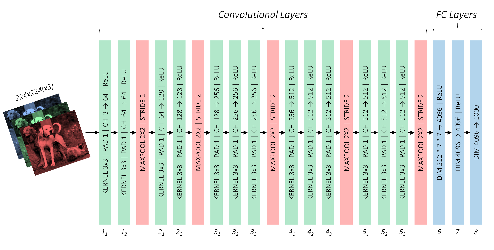
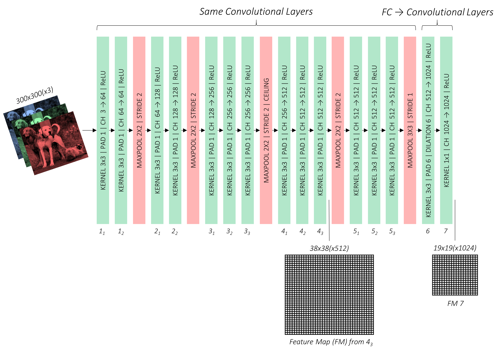
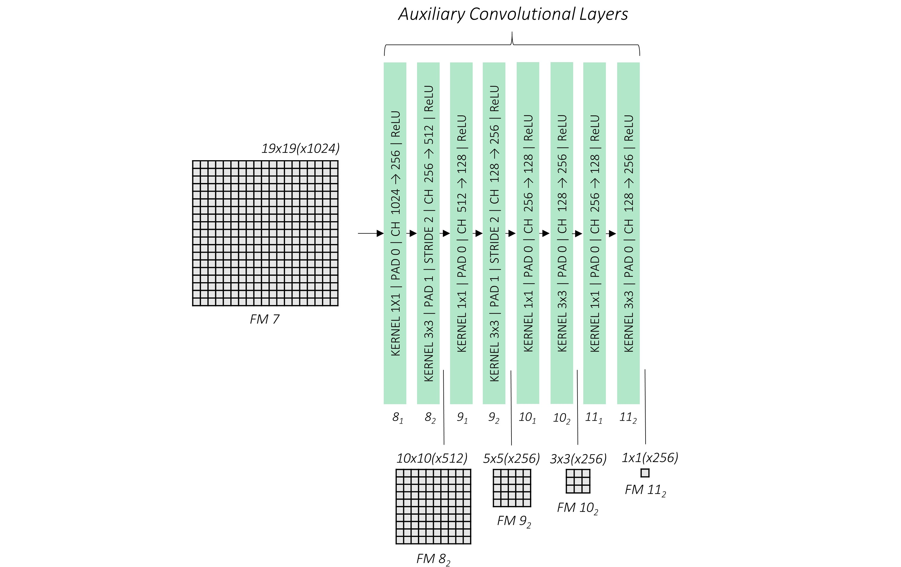
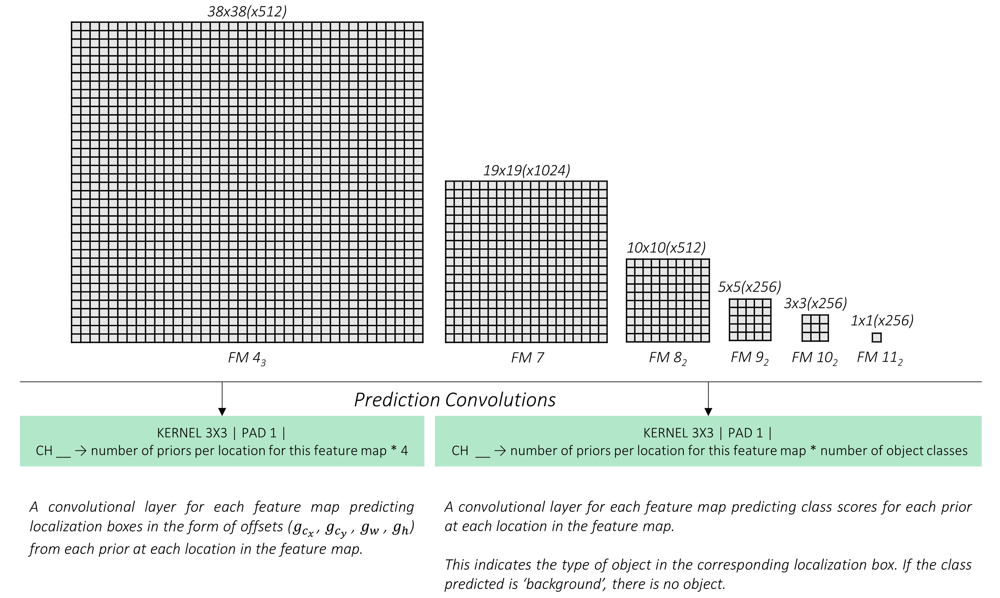
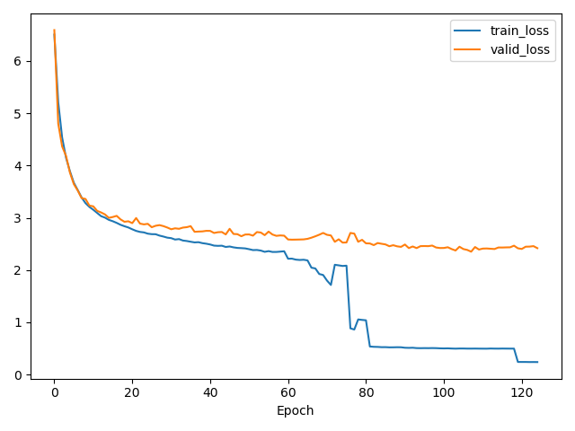

# Description

This is a WIP project that I am currently doing to enrich my knowledge of `PyTorch`, computer vision and deep learning in general. I have used staffs from other developers and followed tutorials during this project. Here's a short description of what's done:

**I followed [1] for most of the coding, but tried to structure the whole project in a more meaningful way.**

The whole project can be divided into 6 parts.
1. Reading, preprocessing and loading the data
2. Model design and implementation; loss formulation and implementation
3. Training model with validation and hyper parameter tuning (hopefully :D)
4. Processing outputs of the model using Non-Maximum Suppression (NMS)
5. Evaluating the model using mAP (11pt & all pt) on testing data
6. Detecting objects in images, videos and live feeds.

## 1. Reading, preprocessing and loading the data
### Data
- PascalVOC: 2007, 2012: These data are parsed and processed using some random transformations which can be found in `data.py` and `input_processing.py`. More specifically, `transform` function inside `input_processing.py` performs the transformations.

## 2. Model building
- Model is built according to [1], architecture is given below.

## 3. Training Model
- Code can be found in `train.py`.
- Added support for `accumulated gradient` upgrade
- Added support for `half-precision` training using `nvidia-apex`
- All of these can be accessed from `main.py`

## 4. Processing Output
- Implements `non-maximum suppression` and produce the actual bounding boxes
- This function is used whenever we need to process the output of the SSD

## 5. Evaluating Model
- Implements `test` function for evaluation on the testing set
- Implements `Average Precision` and `Mean Average Precision` calculation
- Implements `11 Point Interpolation Average Precision` and `All Point Interpolation Average Precision`

## 6. Detecting Objects
- Implements detection and annotation of objects on images
- Implements real-time object detection of on-board camera feed

# Results

## Training with 300 X 300 images
- Trained for 125 epochs using 85-15 train-validation split.

- Sharp drop of `train_loss` around epoch 80 is because of increased batch size
- Initially decreased learning rate if `train_loss` stopped improving
- Later increased `batch_size` using `accumulated gradient` method.
- Used standard `SGD with momentum` with initial learning rate of `1e-3` and an initial `batch_size` of 8.
<table>
<tr><th>11 points interpolation</th><th>All points interpolation</th></tr>
<tr><td>

| Object        | Average Precision|
| ------------- |:-------------:| 
|aeroplane|0.7884710431098938|
|bicycle|0.8282076716423035|
|bird|0.7344603538513184|
|boat|0.6800249218940735|
|bottle|0.4149485230445862|
|bus|0.8429154753684998|
|car|0.8458565473556519|
|cat|0.8873502612113953|
|chair|0.546992301940918|
|cow|0.8079142570495605|
|diningtable|0.7247970104217529|
|dog|0.8680041432380676|
|horse|0.8733161091804504|
|motorbike|0.81952303647995|
|person|0.7613175511360168|
|pottedplant|0.4676790237426758|
|sheep|0.7524116635322571|
|sofa|0.7591263651847839|
|train|0.8569323420524597|
|tvmonitor|0.7407298684120178|
|**mAP**| **0.750**|

</td><td>

| Object        | Average Precision|
| ------------- |:-------------:| 
|aeroplane|0.817555844783783|
|bicycle|0.8592820167541504|
|bird|0.756231427192688|
|boat|0.6991036534309387|
|bottle|0.4026220142841339|
|bus|0.8784138560295105|
|car|0.8762062191963196|
|cat|0.9171531200408936|
|chair|0.5493982434272766|
|cow|0.838248074054718|
|diningtable|0.7483301162719727|
|dog|0.9021250605583191|
|horse|0.9091637134552002|
|motorbike|0.8495721817016602|
|person|0.786540150642395|
|pottedplant|0.4621800482273102|
|sheep|0.7712143063545227|
|sofa|0.7827737927436829|
|train|0.887152910232544|
|tvmonitor|0.7635340094566345|
|**mAP** | **0.773**|
</td></tr> </table>

<!-- {'aeroplane': 0.7884710431098938,
 'bicycle': 0.8282076716423035,
 'bird': 0.7344603538513184,
 'boat': 0.6800249218940735,
 'bottle': 0.4149485230445862,
 'bus': 0.8429154753684998,
 'car': 0.8458565473556519,
 'cat': 0.8873502612113953,
 'chair': 0.546992301940918,
 'cow': 0.8079142570495605,
 'diningtable': 0.7247970104217529,
 'dog': 0.8680041432380676,
 'horse': 0.8733161091804504,
 'motorbike': 0.81952303647995,
 'person': 0.7613175511360168,
 'pottedplant': 0.4676790237426758,
 'sheep': 0.7524116635322571,
 'sofa': 0.7591263651847839,
 'train': 0.8569323420524597,
 'tvmonitor': 0.7407298684120178}

Mean Average Precision (mAP): 0.750 -->
<!-- {'aeroplane': 0.817555844783783,
 'bicycle': 0.8592820167541504,
 'bird': 0.756231427192688,
 'boat': 0.6991036534309387,
 'bottle': 0.4026220142841339,
 'bus': 0.8784138560295105,
 'car': 0.8762062191963196,
 'cat': 0.9171531200408936,
 'chair': 0.5493982434272766,
 'cow': 0.838248074054718,
 'diningtable': 0.7483301162719727,
 'dog': 0.9021250605583191,
 'horse': 0.9091637134552002,
 'motorbike': 0.8495721817016602,
 'person': 0.786540150642395,
 'pottedplant': 0.4621800482273102,
 'sheep': 0.7712143063545227,
 'sofa': 0.7827737927436829,
 'train': 0.887152910232544,
 'tvmonitor': 0.7635340094566345}

Mean Average Precision (mAP): 0.773 -->

## Training with 500 X 500 images
- Trained for 125 epochs using 85-15 train-validation split.
- Used `FusedLAMB` optimizer provided in `nvidia-apex` and trained in `opt_level: O1` with an initial learning rate of `0.001` and batch size of 8.
- When train_loss plateaus, we decrease learning rate by half and increase accumulation factor by one (One gradient update after `batch_size X accumulation_factor` number of forward pass).
- 
# References
1. https://github.com/sgrvinod/a-PyTorch-Tutorial-to-Object-Detection
2. https://github.com/rafaelpadilla/Object-Detection-Metrics
3. https://gist.github.com/jkjung-avt/605904dc05691e44a26bc57bb50d3f04

# Discussion
In this section, I am listing the mistakes I made and tools I have coded to make the training process more intelligible during the implementation for my future references.

1. Made mistake during implementation of `MultiBoxLoss`.
2. Made mistake during implementations of common functions like coordinate conversions.
3. Made mistake during implementations of `create_prior_boxes` which was the main reason behind loss not decreasing below ~4.7.
4. Added modular code for clearing cuda cache.
5. Added modular code for printing out the train loss, validation loss and tracking history.
6. Added modular code for calculating 11 points and all points interpolation average precision.
7. Added support for `accumulated gradient` for training single epoch.

# Learning Outcomes
In this section, I am listing what I learned during this project:

1. Understood how SSD works thoroughly.
2. Learned how to do conversion between a `CNN` layer to `Linear` layer.
3. Learned how to reduce the amount of parameters by decimating the weights of a layer.
4. Learned what is `atrous` convolution and how to use it which allow us to enlarge the field of view of filters to incorporate larger context.
5. Learned to use `apex` for speeding up training by using tensor cores of RTX.
6. Added code for using the SSD on live feed.